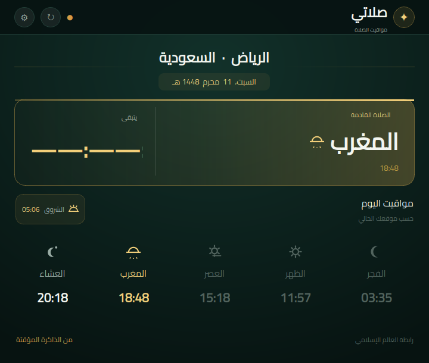

<div dir="rtl" align="center">


# صلاتي

تطبيق سطح مكتب عربي لمواقيت الصلاة على لينكس، مع تنبيهات الأذان والإقامة وأيقونة في شريط النظام.



</div>

## المميزات

- مواقيت الصلاة حسب الموقع وطريقة الحساب والمذهب.
- عدّاد للصلاة القادمة ولوقت الإقامة.
- إشعارات وأصوات قابلة للتخصيص: أذان الحرم، التكبير فقط، أو رنين بسيط.
- قائمة سريعة في شريط النظام تعرض مواقيت اليوم.
- ذاكرة مؤقتة لمواقيت اليوم عند انقطاع الاتصال.
- واجهة عربية متوافقة مع Wayland وX11.

## التثبيت

يتطلب التطبيق Python 3.9 أو أحدث واتصالاً بالإنترنت أثناء التثبيت إذا لم تكن PyQt6 موجودة.

```bash
git clone https://github.com/ham9zah/salaty.git
cd salaty
chmod +x install.sh uninstall.sh
./install.sh
```

بعد التثبيت ابحث عن **صلاتي** في قائمة البرامج، أو شغّله من الطرفية:

```bash
salaty
```

يبدأ التطبيق تلقائياً في الخلفية عند تسجيل الدخول. إغلاق النافذة لا يحذف
التطبيق؛ بل يبقيه في شريط النظام لاستمرار التنبيهات. استخدم خيار **خروج** من
أيقونة شريط النظام لإيقافه، أو سكربت الإزالة لحذفه. فتح التطبيق مرة أخرى يعرض
النسخة العاملة نفسها ولا ينشئ عملية إضافية.

المثبّت لا يحتاج صلاحيات `root`. ينسخ التطبيق إلى:

```text
~/.local/share/salaty
```

ويضيف المشغّل إلى `~/.local/bin` وقائمة التطبيقات إلى `~/.local/share/applications`.

## إزالة التطبيق

```bash
./uninstall.sh
```

يحافظ سكربت الإزالة على الإعدادات. لحذفها أيضاً:

```bash
rm -rf ~/.config/salaty
```

## التشغيل من المصدر

على Ubuntu وDebian:

```bash
sudo apt install python3 python3-pyqt6 gstreamer1.0-plugins-base-apps
./run.sh
```

أو باستخدام بيئة Python:

```bash
python3 -m venv .venv
.venv/bin/pip install -r requirements.txt
SALATY_PYTHON="$PWD/.venv/bin/python" ./run.sh
```

## توافق لينكس

تم الاختبار فعلياً على **Ubuntu 26.04 LTS، GNOME، Wayland، Python 3.14**.

| النظام | الإصدارات المقترحة | الحالة المتوقعة |
|---|---:|---|
| Ubuntu | 22.04، 24.04، 26.04 LTS | ممتاز |
| Linux Mint | 21، 22 | ممتاز |
| Debian | 12، 13 | ممتاز |
| Fedora | الإصدارات المدعومة حالياً | جيد جداً |
| Arch / Manjaro | إصدار محدث | جيد جداً |

يعمل التطبيق على GNOME وKDE Plasma وCinnamon وXFCE، وعلى Wayland وX11. يحتاج شريط النظام في بعض نسخ GNOME إلى إضافة AppIndicator/KStatusNotifier. لا يُنصح حالياً بـ Alpine Linux لأن حزم PyQt6 الجاهزة تستهدف توزيعات `glibc`.

لأفضل نتيجة استخدم نظام 64-بت حديثاً، Python 3.9+، وGStreamer أو PipeWire لتشغيل الأصوات. قائمة إصدارات Ubuntu المدعومة منشورة في [توثيق Ubuntu الرسمي](https://ubuntu.com/project/docs/release-team/list-of-releases/)، بينما PyQt6 متاحة من [PyPI](https://pypi.org/project/PyQt6/).

## الشبكة والخصوصية

- يستخدم التطبيق `ip-api.com` لتحديد الموقع التقريبي تلقائياً.
- يجلب المواقيت من `api.aladhan.com`.
- يمكن تعطيل تحديد الموقع التلقائي وإدخال الإحداثيات يدوياً.
- تُحفظ الإعدادات محلياً في `~/.config/salaty`.

## الترخيص

شفرة صلاتي مرخصة تحت GNU GPL v3. راجع [LICENSE](LICENSE). تراخيص الخطوط والأصوات مذكورة في [THIRD_PARTY_NOTICES.md](THIRD_PARTY_NOTICES.md).
